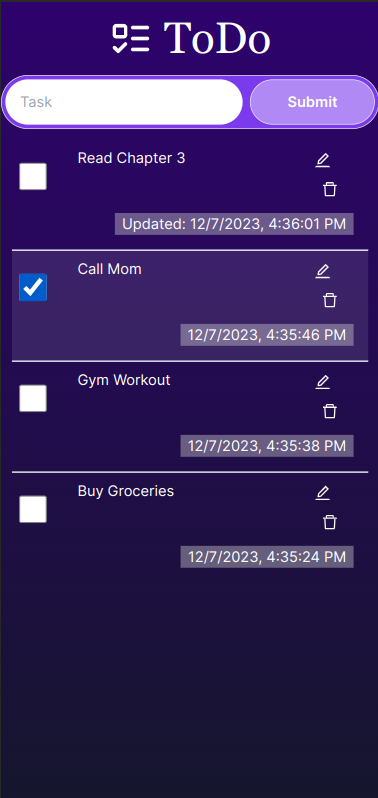

# T3 ToDo App

This is a [T3 Stack](https://create.t3.gg/) project bootstrapped with `create-t3-app`.

## Description 
The Todo app is a simple yet powerful tool designed to help users organize tasks efficiently.

## Dependencies
- [Next.js](https://nextjs.org)
- [Prisma](https://prisma.io)
- [Tailwind CSS](https://tailwindcss.com)
- [tRPC](https://trpc.io)

## How to run

1. Clone this repo with `git clone https://github.com/AndriiVeremchuk20/t3-todo.git`
2. Move to the project directory: `cd t3-todo`
3. Install dependencies: `yarn install`
4. To build the project: `yarn build`
5. To start the project: `yarn start`
6. For development mode: `yarn run dev`
7. Open Prisma studio: `yarn db:studio`
